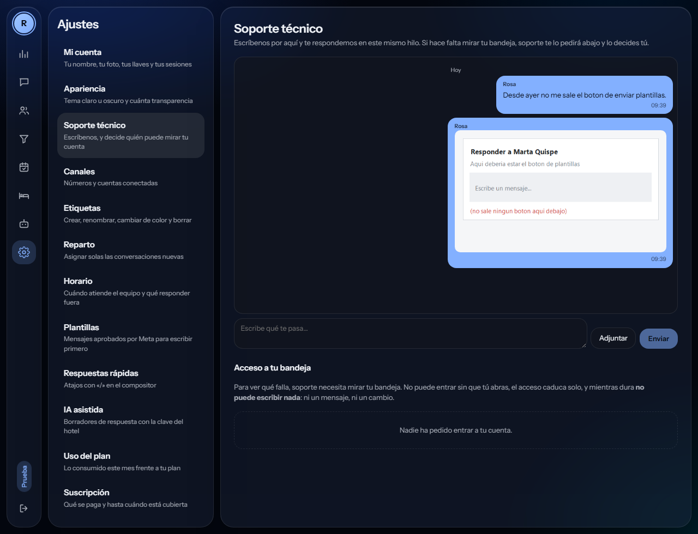

# Módulo — Facturación y ciclo de vida de la cuenta

## Qué se cobra (PR-29, [[ADR-011-modelo-de-cobro]])

**Suscripción por asiento ocupado.** El importe mensual es el precio del plan por los miembros de la cuenta, y **los asientos se cuentan, no se guardan**: una columna `seats` habría que mantenerla sincronizada con cada alta y baja, y el día que se desincronice le cobra de más a un cliente — que es el error que sí se nota. `plans.limits.agentes` pasa a ser el techo de asientos: invitar por encima devuelve `limite_de_asientos` (402), contando también las invitaciones pendientes, porque tres enviadas a la vez colarían tres asientos.

**La mensajería de Meta no pasa por nosotros.** El cliente conecta su propio WABA con su propio método de pago, como en Kommo. No la absorbemos, no la revendemos, no la conciliamos.

**El cobro es manual y lo registra el operador**, nunca el inquilino: `pnpm suscripcion:pago --cuenta=<slug> --meses=<n>`. Extiende desde lo que ya estaba cubierto —no desde hoy—, así pagar con dos días de adelanto no regala ni quita tiempo. La garantía no es «no hay endpoint», que sería una promesa: `subscription_payments` es de **solo lectura para el rol de la aplicación** (migración 0016) y hay un test que lo comprueba intentando escribir.

**Pasarse de un límite avisa; solo se corta lo nuestro.** Al 80 % aparece el aviso; al 100 % dejan de arrancar bots nuevos —los que ya corren terminan, porque cortar a mitad deja al contacto esperando— y las conversaciones entrantes **no se cortan jamás**.

`GET /v1/cuenta/suscripcion` devuelve plan, asientos, importe, hasta cuándo está cubierta la cuenta, los últimos doce pagos y los avisos. Se pinta en **Ajustes → Suscripción** (PR-30):

![[2026-09-10-suscripcion.png]]

**No hay botón de pagar, y no es un olvido.** El cobro es manual: la pantalla enseña el importe, la cobertura y el historial, y el pago se registra por fuera. Un botón que no cobra es peor que no ponerlo. Y la primera línea dice lo que el cliente necesita saber antes de preguntarlo: **el consumo de WhatsApp lo cobra Meta directamente en su cuenta; aquí solo va la suscripción.**

## El ciclo, fijado por el usuario el 2026-09-09

```
prueba (1 mes)   ──caduca sin pagar──▶  gracia (7 días)  ──▶  suspendida
activa (pagada)  ──no renueva────────▶  gracia (7 días)  ──▶  suspendida
```

| Estado | Enviar | Bots e IA | Canales | Interfaz |
|---|---|---|---|---|
| prueba / activa | Todo, según plan | Sí | Conectados | Normal |
| **gracia** (7 días) | **Solo texto.** Sin imagen, vídeo, audio, documento ni plantillas | **Detenidos** | Conectados | Normal, con aviso |
| **suspendida** | Nada | Detenidos | **Desconectados** | Solo lectura: consultar y exportar |

Implementado en `packages/core/src/entitlements.ts`. Dominio puro, sin I/O.

## Por qué la lógica vive en `core`

No es organización de carpetas. `apps/web` no puede importar `core` y lo vigila `scripts/check-architecture.sh`, así que **un cliente cuya prueba caducó no puede recuperar el envío de imágenes editando el estado de un componente**. Si la comprobación viviera en React, sería una sugerencia.

## Decisiones que evitan bugs caros

**El estado efectivo se deriva de las fechas, no de la columna `status`.** La columna es una caché que mantiene un job. Si la política confiara en ella, un cliente cuya gracia venció a las 3 de la mañana seguiría enviando hasta que el cron pasara. Hay test.

**Los días de gracia se guardan por suscripción, copiados del plan al crearla.** Si se leyeran del plan al evaluar, cambiar la gracia de 7 a 14 días alargaría la de todos los clientes vivos, retroactivamente. Hay test.

**Cancelar no corta a mitad de periodo.** Significa "no renueves", no "córtame ahora". Cortar al cancelar es quedarse con dinero por un servicio no prestado.

**El periodo pagado manda sobre la prueba.** Si el cliente paga a mitad de prueba, vale lo que compró. Sin esto, quien paga pronto se quedaría degradado al acabar la prueba pese a estar al día.

**Sin fechas, la cuenta está suspendida.** Fallar cerrado: una suscripción en estado corrupto no envía.

## Desconexión del canal al suspender

**Al suspender se da de baja la suscripción del webhook en el proveedor.** La alternativa —recibir y descartar— es peor: rechazar webhooks provoca reintentos de Meta y, sostenido en el tiempo, **puede llevar a que Meta desactive nuestro webhook**, lo que afectaría a todos los clientes, no solo al moroso.

Reconectar al pagar es automático y no molesta al cliente: su token sigue cifrado en `channel_secrets`, así que no vuelve a autorizar nada. Es una ventaja que sale gratis de [[ADR-004-modelo-whatsapp]].

Consecuencia asumida: los mensajes que le escriban mientras está desconectado **no llegan nunca a la plataforma**. Quedan en su cuenta de WhatsApp, no en su bandeja. Es lo que hace Kommo.

`persisteEntrantesEnCrudo` sigue siendo `true` en todos los estados, pero ya solo cubre un caso de carrera: eventos que el proveedor tenía en vuelo cuando se dio de baja la suscripción. A esos se responde 200 y se guardan, porque devolver error solo genera reintentos.

## Bug de calendario que encontró un test

`finDePrueba` usaba `setMonth(getMonth() + 1)`. El 31 de enero más un mes da "31 de febrero", que JavaScript convierte en **3 de marzo**: tres días de prueba regalados a todo el que se registre a fin de mes. Además usaba hora local en un sistema que es UTC en todo lo demás. Corregido recortando al último día del mes destino, con tests de bisiesto y cruce de año.

## Pendiente

- **P-21** qué medimos y cobramos. Con el costo de mensajería fuera ([[ADR-004-modelo-whatsapp]]), la IA es lo único que nos cuesta dinero de verdad.
- **P-10** proveedor de pagos. Stripe era referencia, no decisión.
- Los precios sembrados en la migración 0007 son marcador de posición.

## Factura o boleta, y el comprobante descargable (PR-87, 2026-09-21)

Primera mitad del punto 6. El hotel elige qué comprobante necesita por su suscripción al CRM, y lo descarga cuando lo subimos.

### Por qué factura Y boleta, y no «un comprobante»

En Perú no son lo mismo y no se eligen por gusto:

- **Factura**: para quien tiene RUC y va a usar el gasto como crédito fiscal. Exige RUC, razón social y dirección.
- **Boleta**: para persona natural. Basta el DNI —opcional por debajo de S/ 700— y no da crédito fiscal.

Un hotel formal querrá factura. Si el CRM manda boletas, ese gasto no se deduce. Preguntarlo una vez evita un problema mensual.

### El RUC se comprueba de verdad

`packages/core/src/facturacion.ts` valida el **dígito de control** por módulo 11, no solo la longitud. Un RUC mal tecleado no lo rechaza nadie hasta que SUNAT devuelve la factura, semanas después y con el crédito fiscal perdido. Esto atrapa el error más común —dos cifras cambiadas de sitio— al escribirlo.

No comprueba que el RUC **exista**: para eso haría falta preguntarle a SUNAT, que es una integración con su propia caducidad y su propio permiso.

El DNI se valida solo por longitud: lleva un carácter de verificación que **no está impreso en los documentos antiguos**, y exigirlo rechazaría a personas con su DNI en la mano.

### Pendiente no es lo mismo que retrasado

Cada pago dice el estado de su comprobante: `pendiente` mientras quedan horas, `retrasado` pasadas las 48, `disponible` cuando está. Lo segundo es un incumplimiento **nuestro**, y el hotel tiene derecho a verlo sin preguntar por WhatsApp. Sale en rojo.

El plazo se **calcula** desde que se registra el pago, no se guarda: un plazo guardado y un pago con la fecha corregida se separan, y entonces la pantalla promete algo que ya no es. Y se cuenta desde el registro, no desde lo que cubre — un pago de enero registrado en marzo no nace vencido.

## El primer cruce de inquilino: el operador de la plataforma

Subir el comprobante es lo único que alguien de fuera de una cuenta escribe dentro de ella. Vive en `apps/api/src/uso/operador.service.ts`, en su propio archivo y bajo `/v1/operador`, porque **un cruce de inquilino tiene que verse en cualquier búsqueda**.

Cuatro cierres, y cada uno haría falta aunque fallaran los otros:

1. **`users.is_operator`**, que no se activa desde la aplicación. Se pone por consola **con el superusuario**: `users` lleva RLS forzada y ni el dueño de la tabla la salta, así que un `UPDATE` desde la cuenta de la aplicación no toca ninguna fila **y no se queja**. Un botón de «hazme operador» sería un botón de «dame todas las cuentas».
2. **Se entra por la puerta**: el contexto se fija al inquilino de destino con `paraInquilino`, así que la RLS sigue aplicándose dentro. No se desactiva nada. Por eso un medio de otra cuenta simplemente no se encuentra, sin ninguna comprobación escrita a mano — que es la comprobación que alguien acaba olvidando.
3. **Permiso por COLUMNA.** En 0016 se le quitó a la aplicación toda escritura sobre `subscription_payments`: nadie puede declararse pagado. Esa regla se queda. Lo que se concede son las **tres columnas del comprobante**, con `GRANT UPDATE (col, col, col)`. El importe y las fechas siguen intocables.
4. **Auditoría en la cuenta del hotel**, con el usuario de plataforma que lo hizo. El hotel puede ver quién tocó su cuenta desde fuera.

Quien no es operador recibe **404, no 403**: un 403 le confirmaría que la ruta existe a quien la está buscando.

Lo que el operador **no** puede hacer: leer conversaciones, mensajes, contactos ni reservas.

### Lo que costó un rato

El test del operador daba 404 sin explicación. Dos causas encadenadas, las dos del mismo tipo —**no fallan, devuelven vacío**:

1. `UPDATE users SET is_operator = true` desde el rol dueño no tocaba ninguna fila: `users` lleva RLS **forzada**, que se aplica también al propietario de la tabla.
2. El fichero de test no pasaba `authDatabaseUrl`, así que la lectura de identidad caía al rol de inquilino, y la política que deja leer `users` es del rol de autenticación.

### Cómo comprobarlo en menos de 5 minutos

Ajustes → Suscripción. Cambia a **Factura**: aparecen RUC, razón social y dirección. Escribe un RUC con un dígito cambiado y guarda: lo rechaza diciendo por qué. Con uno bueno, se guarda. Abajo, cada pago dice si su comprobante está en camino, retrasado, o listo para descargar.

34 tests nuevos (14 del RUC y el plazo, 9 de API, 11 de pantalla). Comprobado además contra la API real: subir el PDF, adjuntarlo como operador y verlo disponible desde la cuenta del hotel.

## La consola del operador (PR-88, 2026-09-21)

Segunda mitad del punto 6. Todas las cuentas de la plataforma en una tabla, ordenadas por lo que hay que atender hoy.

Contesta tres preguntas, en este orden:

1. **¿A quién le debo un comprobante?** Es lo único con un plazo legal encima —48 horas—, y por eso manda el orden de la tabla y sale un aviso arriba sin tener que contar filas.
2. **¿A quién se le vence?** Lo segundo que decide a quién se llama.
3. **¿Qué cuenta se está quedando muda?** Un canal caído, o cero mensajes en el mes, es un cliente que se va sin avisar.

### El rol, que es la decisión de verdad

Leer todas las cuentas a la vez es, por definición, atravesar el aislamiento que sostiene el producto. Migración 0040: **un rol de base de datos**, `crmapp_operador`.

**Por qué un rol y no una bandera de sesión.** La alternativa era «si `app.operador` está puesto, deja leerlo todo», y es frágil: cualquier camino que consiga ejecutar un `set_config` desbloquea la base entera. Un rol no se cambia desde dentro de una consulta. Es el patrón que ya usaban el rol de autenticación (0008) y el del relay (0006); esto lo sigue en vez de inventar otro.

**Por qué no `BYPASSRLS`.** Se aplicaría a toda la base y para siempre. Aquí el escape son políticas nombradas sobre una lista corta de tablas: facturación, suscripciones, pagos, consumo y estado de canales. Lo que no esté en esa migración, el operador no lo ve, y añadir una tabla es un cambio que se lee en una revisión.

**Y es de solo lectura.** Si alguien encadenara una inyección hasta este rol, podría contar cuentas ajenas, no tocarlas. Lo único que el operador escribe —el comprobante de un pago (0039)— pasa por el rol de aplicación entrando en el contexto del inquilino.

Dos tests lo comprueban **contra la base de datos, no contra la API**: que el rol recibe `permission denied` al leer `conversations`, `messages` y `contacts`, y al intentar escribir lo que sí puede leer. Así sigue siendo verdad aunque mañana alguien escriba una consulta nueva en la consola.

La respuesta de la API se fija con **lista blanca de campos**, no con lista negra de palabras: buscar «mensaje» en el JSON es burdo —`mensajesDelMes` es un contador y la contiene— y además no protege de un campo nuevo con otro nombre.

### Por qué una consulta y no una por inquilino

Recorrer inquilinos entrando en el contexto de cada uno habría mantenido la RLS de siempre, pero son cinco consultas por cuenta: con cien cuentas, quinientas idas y vueltas para pintar una tabla. El rol existe justo para evitarlo.

### El fallo que encontró una captura

La celda de estado decía **«vence »** y nada detrás. `hace()` solo sabe de tiempos pasados y devuelve `null` con cualquier fecha futura. Hacía falta su gemela, `faltan()`, que además cuenta **días de calendario** y no horas: a las once de la noche, «en 1 día» y «mañana» son la misma fecha, pero solo una organiza el trabajo de quien la lee.

Ningún test lo habría visto: los tests miran el DOM y ahí el texto estaba: «vence» seguido de nada.

### Cómo comprobarlo en menos de 5 minutos

Actívate como operador (comando en 0039) y aparece un icono de edificios en el riel. La consola ordena por deuda de comprobante y marca en rojo lo que pide una llamada.

15 tests nuevos (6 de API —dos de ellos contra la base—, 9 de pantalla, 5 de `faltan()`).

## Modo soporte: el cliente deja entrar, y solo un rato (PR-90, 2026-09-21)

La consola del operador (0040) ve cifras de todas las cuentas y ni una conversación. Eso es lo que la hace defendible. Pero cuando un cliente escribe «no me llegan los mensajes», mirar cifras no alcanza: hay que ver su bandeja, y eso son conversaciones de huéspedes.

El usuario lo pidió con sus condiciones, y son las cuatro que se implementaron.

### 1. Lo autoriza el cliente

El operador **pide** diciendo para qué; alguien de la cuenta **abre**. El motivo es obligatorio y largo: «necesito entrar» no es algo que el cliente pueda valorar, y es lo único que tiene para decidir.

Que el operador no pueda aprobarse a sí mismo **no lo garantiza el código**: su rol de base de datos tiene `INSERT` sobre `support_grants` con un `WITH CHECK` que exige `approved_by IS NULL`, y no tiene `UPDATE`. Hay un test que lo comprueba contra PostgreSQL. Un permiso que uno se da solo es una llave maestra.

### 2. Caduca solo

El plazo lo fija **quien abre la puerta**, no quien llama: 1, 4, 8 o 24 horas, en cuatro botones. Un campo vacío invita a escribir 999. Se puede cerrar antes en cualquier momento, y ese mismo botón sirve para rechazar.

### 3. Solo lectura, garantizado por PostgreSQL

El rol `crmapp_soporte` **no tiene INSERT, UPDATE ni DELETE sobre nada**. Un soporte que puede escribir puede romper, y entonces nadie sabe si el fallo era del cliente o de quien fue a ayudarle.

Tampoco hizo falta escribir políticas nuevas: `tenant_isolation` (0001) no lleva cláusula `TO`, así que se aplica a cualquier rol. Al de soporte le basta el `GRANT SELECT` y queda encerrado en el inquilino del contexto. Hay un test que lo demuestra: con ese rol y **sin** inquilino puesto, `SELECT FROM conversations` devuelve cero filas.

Y si `DATABASE_SOPORTE_URL` no está configurada, el servicio **se niega a funcionar** en vez de caer al rol que sí escribe. Fallar cerrado.

### 4. Queda en la auditoría del cliente

`soporte.solicitado`, `soporte.aprobado`, `soporte.revocado`, con quién y cuándo. La pantalla enseña también los accesos pasados, y distingue los que **nunca se abrieron**: el valor del registro está en poder mirarlo sin preguntarle a nadie.

### Lo que se ve al entrar

No es la bandeja: es la lista de lo que falla. Siete campos por conversación —canal, estado, últimas fechas, mensajes fallidos y el último error— porque «no me llega» y «no se envía» se contestan con eso, no leyendo lo que la gente se dice. Un test fija esos campos con lista blanca.

## La guarda que salió de aquí: clases de CSS que no existen

La primera captura de la pantalla de soporte salió con viñetas y sin estilo. El componente usaba cinco clases que vivían en la hoja de **otra** pantalla, porque el nombre encajaba. `estilos.sesiones` sobre una hoja que no la declara devuelve `undefined`, React pinta `class="undefined"` y el bloque sale desnudo. **No falla, no avisa.**

Es la misma familia que los tokens de CSS inexistentes (PR-84), un nivel más arriba, así que `check-puertas.mjs` la vigila ahora también. Encontró **tres casos que ya estaban en el repositorio**:

- `MapaDelFlujo`: una clase en el `<g>` de las aristas que no pintaba nada. Sobraba; se quitó.
- `Hilo`: `.estado` no existía, así que **el estado de entrega de un mensaje saliente no tenía estilo propio** y un «No se envió» se veía igual que un «Leído». Ahora existe, y el fallo va en rojo.
- `Informe`: falso positivo mío. `.num` está declarada como `.tabla .num`, y mi patrón solo leía la primera clase de cada línea. Corregido para leer el selector entero.

Detalle de implementación que costó un rato: las expresiones regulares de esa guarda van **sin una sola barra invertida**, con clases de caracteres. Escribirlas con `\b` o `\w` las dejaba mutiladas al pasar por las capas de comillas del shell, y el resultado era una guarda que no encontraba nada y parecía funcionar.

### Cómo comprobarlo en menos de 5 minutos

Actívate como operador, pide acceso a una cuenta desde la API, y entra en esa cuenta → Ajustes → Acceso de soporte. Verás quién pide y por qué. Antes de abrir, la consulta de soporte devuelve 403; al abrir, 200; al cerrar, 403 otra vez.

22 tests nuevos (12 de API —cuatro contra la base— y 10 de pantalla).

## Chat con soporte técnico (PR-91, 2026-09-21)

Cierra el círculo del modo soporte: por aquí llega el «no me llegan los mensajes» que justifica pedir el acceso.

### Qué reemplaza, y por qué importa

Hoy un cliente con un problema escribe por WhatsApp a un número personal. Eso tiene tres consecuencias que se pagan más tarde: el historial se pierde, nadie del equipo sabe qué se respondió, y **quien atiende no tiene delante ni el plan ni el estado de los canales de esa cuenta**. En la consola, el hilo se abre debajo de la tabla —no en una ventana— justo para que eso siga a la vista mientras se responde.

### Un hilo por cuenta, no tickets

Un sistema de tickets pide categorías, prioridades, estados y alguien que los mantenga. Para un producto con tres clientes eso es ceremonia. Un hilo continuo —como hablar por WhatsApp, que es lo que ya hacen— resuelve el 100 % de los casos de hoy, y el día que no baste, los mensajes ya están guardados y se pueden agrupar.

### Por qué NO reutiliza `conversations`

Esa tabla es la correspondencia con los **huéspedes**: la mira la bandeja, cuenta para los topes del plan, la tocan los bots y la gobierna la ventana de 24 horas de Meta. Meter aquí los mensajes a soporte ensuciaría las cifras que el cliente usa para saber cuánto consume, y un bot podría acabar respondiéndole a soporte. Hay un test que comprueba que escribir a soporte **no crea ninguna conversación**.

### Decisiones pequeñas que se notan

- **Cualquiera del equipo puede escribir.** El que se topa con el problema es quien lo cuenta; obligar a avisar al dueño solo garantiza que no se reporte.
- **Abrir el hilo SÍ lo marca como leído** — lo contrario que la bandeja (PR-83), y a propósito: allí «leído» es una decisión sobre el trabajo de un equipo, y aquí es tu propia conversación con quien te vende el producto.
- **Sin contador guardado.** El «sin leer» se cuenta de `read_at IS NULL`, porque un contador es lo que se desincroniza.
- **La consola ordena primero a quien espera respuesta**, antes que a quien espera comprobante: un cliente escribiendo está parado y no sabe si le han leído.
- **Responder no exige permiso de soporte.** Contestar a quien te escribió no es entrar en su casa.
- **El mismo componente sirve para los dos lados**, con `tenantId` invirtiéndolos. Hay dos tests solo para eso: sin ellos, el operador vería sus propias respuestas como si las hubiera escrito el cliente.

### La lista blanca hizo su trabajo

Añadir `soporteSinLeer` a la consola rompió el test que fija los campos exactos de esa respuesta (PR-88). Es justo para lo que está: un campo nuevo en una pantalla que cruza el aislamiento entre cuentas tiene que declararse a propósito, no colarse.

### Cómo comprobarlo en menos de 5 minutos

Ajustes → Soporte técnico: escribe algo. En la consola del operador aparece «1 cuenta espera respuesta» arriba y «1 sin leer» en rojo en su fila. Pulsa ahí, responde, y el cliente lo ve en su hilo sin que nadie se lo reenvíe.

21 tests nuevos (10 de API, 11 de pantalla).

## Capturas en el chat (PR-93, 2026-09-23)

Lo pidió el usuario con sus palabras: «que pueda enviar foto o vídeo en caso el usuario interactua con el soporte le pida esa información de que sucede en su CRM».

«No me sale el botón» y una captura del botón que no sale son la misma frase, pero solo una se entiende a la primera.

### Por qué reutiliza `media_assets` y no una tubería nueva

Ya existe todo: subida por URL firmada sin que los bytes pasen por la API, deduplicación por `sha256`, límite de tamaño, lista de tipos admitidos y descarga firmada de vida corta. Una segunda tubería para soporte sería mantener dos, y la segunda no tendría **ninguna** de esas cosas hasta que a alguien le tocara añadírselas.

El medio es del **inquilino**, como cualquier otro. Que soporte pueda verlo es un permiso aparte y acotado, no una propiedad del archivo.

### La decisión que sostiene la consola

El cliente ve sus propias capturas por `/v1/medios/:id/url`, que RLS ya le resuelve. El operador **no puede** usar esa ruta: su contexto de sesión es su propio inquilino, no el del cliente.

La tentación era darle una ruta que firmara cualquier `mediaAssetId` de cualquier cuenta. Eso habría roto en silencio la promesa que hace defendible toda la consola —**el operador no ve conversaciones de huéspedes**—, porque una foto de la bandeja es exactamente eso.

Por eso `urlDeAdjunto` exige que el medio **cuelgue de un mensaje de soporte de esa cuenta**, con el `JOIN` dentro de la propia consulta:

```sql
FROM media_assets a
JOIN support_messages m ON m.media_asset_id = a.id
WHERE a.id = $1 AND m.tenant_id = $2
```

Un medio ajeno al hilo y uno inexistente se contestan igual (404): quien pregunta no averigua si el identificador existe en otra parte. Hay un test que crea un medio **de la misma cuenta** pero no adjunto, y comprueba que el operador recibe 404. Si alguien quitara ese `JOIN`, ese test se pone rojo.

### El adjunto se valida en el INSERT, no antes

```sql
INSERT INTO support_messages (...)
SELECT $1, $2, $3, $4, $5::uuid
 WHERE $5::uuid IS NULL
    OR EXISTS (SELECT 1 FROM media_assets a
                WHERE a.id = $5::uuid AND a.tenant_id = $1 AND a.status = 'stored')
```

Comprobarlo antes en una consulta aparte dejaría un hueco entre la comprobación y la escritura, y sobre todo dejaría la garantía en el código en vez de en la base. Cero filas devueltas es «esa captura no es tuya o no está subida», y se responde 409.

### Decisiones pequeñas

- **El cuerpo deja de ser obligatorio cuando hay adjunto.** Mandar una captura sin texto es una forma legítima de decir «mira esto»; obligar a escribir algo solo produce mensajes que dicen «.». La reversa de 0044 rellena esos cuerpos con `(captura adjunta)` antes de volver a exigirlo.
- **Adjunta el cliente, no soporte.** Quien tiene el problema delante es él. Cuanto menos escriba soporte en la cuenta de un cliente, menos hay que explicar después.
- **Se sube al elegir el archivo, no al enviar.** Un vídeo de 8 MB por datos móviles convertiría «Enviar» en un botón que parece colgado.
- **El adjunto elegido se ve antes de enviarlo, y se puede quitar.** Uno que no se ve hasta después es un adjunto que se manda sin querer.
- **La URL se pide al pintar y caduca a los 5 minutos**, así que no se puede guardar en el mensaje ni reenviar por ahí.

### Lo que encontró la captura de pantalla

La primera salió con la burbuja del adjunto **vacía**. No era el código: el PNG que había sembrado para la prueba era de 1×1 píxel, y `max-inline-size: 100%` no agranda nada. Con una imagen de tamaño real se ve como debe. Vale la pena anotarlo porque el reflejo era ir a depurar el componente.

### Cómo comprobarlo en menos de 5 minutos

1. Ajustes → Soporte técnico → **Adjuntar**, elige una captura. Aparece su nombre encima del compositor con un «Quitar».
2. **Enviar** sin escribir nada: la captura sale en el hilo.
3. Desde la consola del operador, abre el hilo de esa cuenta: la misma captura se ve, firmada por la ruta acotada.
4. Con `curl`, pide `/v1/operador/soporte/<cuenta>/adjuntos/<un medio de la bandeja>`: **404**.



16 tests nuevos (7 de API —contra PostgreSQL— y 9 de pantalla).
